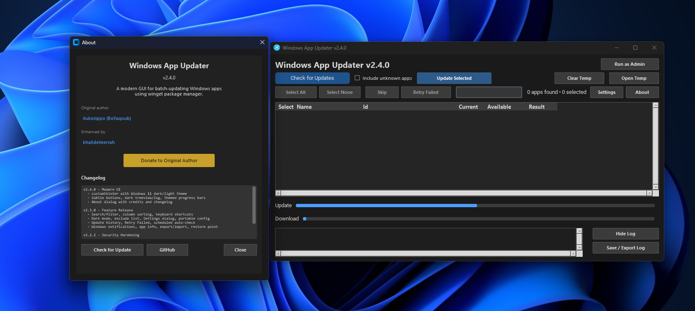

# Windows App Updater

A modern GUI tool for batch-updating installed Windows applications using [winget](https://learn.microsoft.com/en-us/windows/package-manager/winget/) (Microsoft's package manager). Built with Python and customtkinter for a native Windows 11 look.

> **Original project by [ilukezippo (BoYaqoub)](https://github.com/ilukezippo/Windows-App-Updater)**
> This fork adds a modern UI, new features, and security hardening.




---

## Download

[**Download Windows-App-Updater.exe (v2.4.0)**](https://github.com/khalidelmerrah/Windows-App-Updater/releases/download/v2.4.0/Windows-App-Updater.exe)

No installation required. Just download and run the `.exe` file.

See all releases: [Releases page](https://github.com/khalidelmerrah/Windows-App-Updater/releases)

---

## Features

### Core
- **One-click update check** - Scans all installed apps via winget and shows available updates
- **Batch update** - Select individual apps or update all at once
- **Skip / Cancel** - Skip the current app or cancel the entire batch mid-update
- **Retry Failed** - One-click to re-select and retry only failed apps
- **Real-time progress** - Dual progress bars (overall + per-app download) with animated spinner
- **Include unknown apps** - Toggle to include apps with unrecognized version numbers
- **Run as Admin** - One-click UAC elevation for silent installs
- **Self-update** - Checks GitHub releases for newer versions and can download/replace itself automatically

### Search & Navigation
- **Search/filter** - Find apps instantly by name or package ID
- **Column sorting** - Click any column header to sort ascending/descending
- **Keyboard shortcuts** - Ctrl+A (select all), Enter (start update), Escape (cancel)

### Customization
- **Modern UI** - customtkinter with Windows 11 native dark/light theme support
- **Dark mode** - Follows Windows system theme automatically, or toggle manually in Settings
- **Exclude list** - Right-click any app to permanently exclude from updates
- **Portable config** - All settings saved to config.json next to the EXE
- **Settings dialog** - Central place for all preferences

### Automation
- **Scheduled auto-check** - Configurable interval (1/4/8/24 hours)
- **Windows notifications** - Toast notification when updates complete
- **System restore point** - Optional restore point before batch updates (requires admin)

### Tools
- **App info popup** - Right-click or double-click any app to view details via winget
- **Update history** - Last 50 update sessions tracked, viewable in Settings
- **Export/import apps** - Export installed app list to file, bulk install on new machines
- **Update log** - Live log output with export to file, collapsible panel
- **Temp file management** - View, open, or clear temporary installer files
- **Per-app download tracking** - Right-click to open or delete downloaded installers
- **Success sound** - Plays a sound when all updates complete without errors
- **Resizable window** - Supports full-screen / maximize with responsive layout

## Requirements

- Windows 10/11
- [winget](https://learn.microsoft.com/en-us/windows/package-manager/winget/) (included with Windows 10 1809+ and Windows 11 via App Installer from Microsoft Store)

### Running from source

```bash
pip install pillow customtkinter
python App-Updater.py
```

### Building the EXE

```bash
pip install pyinstaller pillow customtkinter

pyinstaller --noconfirm --onefile --windowed ^
  --name "Windows-App-Updater" ^
  --icon "windows-updater.ico" ^
  --add-data "success.wav;." ^
  --add-data "kuwait.png;." ^
  --add-data "windows-updater.ico;." ^
  --hidden-import customtkinter ^
  App-Updater.py
```

Output: `dist/Windows-App-Updater.exe`

## Security Hardening

This fork includes the following security fixes over the original:

### Critical
- **Batch script injection prevention** - Self-update paths sanitized to strip dangerous characters
- **Symlink attack protection** - Temp cleanup rejects symlinks before changing permissions
- **Download URL validation** - Restricted to HTTPS GitHub URLs only, filenames sanitized against path traversal

### High
- **DLL hijacking prevention** - VC runtime checks use absolute System32 paths
- **UAC parameter injection fix** - Uses `subprocess.list2cmdline()` for proper argument escaping

### Medium
- **Dead code removal** - Removed unused duplicate download method
- **Log memory cap** - Capped at 5,000 lines to prevent unbounded memory growth
- **Symlink-safe temp snapshots** - Uses `os.lstat()` to avoid following symlinks
- **Thread safety** - Added `threading.Lock()` for shared state

## Changelog

### v2.4.0 - 2026-04-16
- Modern UI with customtkinter (Windows 11 native dark/light theme)
- Subtle dark gray buttons with 4px corner radius
- Treeview, log, and progress bars properly themed for dark mode
- Settings and About dialogs render on top of main window
- Smaller checkboxes (13x13) for native feel
- Loading dialog shows proper title

### v2.3.0 - 2026-04-16
- Search/filter box to find apps by name or ID
- Column sorting (click headers)
- Keyboard shortcuts (Ctrl+A, Enter, Escape)
- Dark mode with live toggle
- Exclude list (right-click to exclude apps)
- Portable config.json for all settings
- Settings dialog
- Update history (last 50 sessions)
- Retry Failed button
- Scheduled auto-check (1/4/8/24 hours)
- Windows toast notifications on completion
- App info popup (right-click or double-click)
- Export/import installed app list
- System restore point option before updates

### v2.2.2 - 2026-04-16
- Security hardening (batch injection, symlink, DLL hijacking, parameter injection fixes)
- Download URL validation (HTTPS GitHub only)
- Dead code removal, log cap, thread safety
- Window maximize fix

## Credits

- **Original author:** [ilukezippo (BoYaqoub)](https://github.com/ilukezippo/Windows-App-Updater)
- **Security hardening, features & UI:** [khalidelmerrah](https://github.com/khalidelmerrah/Windows-App-Updater)
